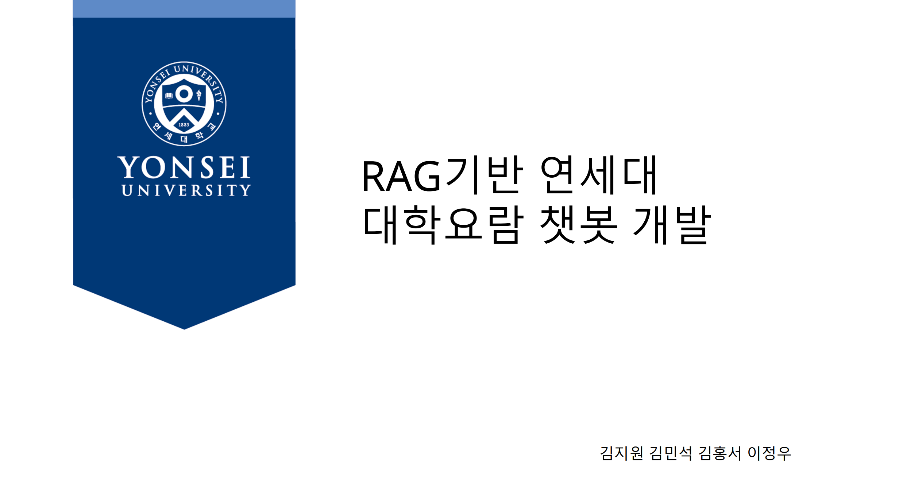

# **24-2_NLP1_yonsei_graduation_RAG**
NLP 1조 - DSL 11기 김지원 김민석 김홍서  12기 이정우

# **Rag기반 연세대 대학요람 챗봇 개발** 

# Streamlit 이용 방법
# **Version 1(로컬 포함)**

## 로컬에서는, 
```
pip install -r requirements.txt
streamlit run yonsei-graduation-chatbot.py
```

## 앱 배포를 하려면,
#### https://share.streamlit.io/ 에서 Create App 누르고,

#### Main file path를 yonsei-graduation-chatbot.py 로 한다.
#### Deploy!를 하면 app이 생성된다.

#### 유효한 Google Gemini API Key를 입력하고 나면,

#### 챗봇을 사용할 수 있다.
<br><br><br>


# **Version 2 (발표용)**
#### https://share.streamlit.io/ 에서 Create App 누르고,

#### Main file path를 yonsei-graduation-chatbot_secret.py 로 한다.
#### **Advanced settings**을 누르고,

#### api_key = '유효한 Google Gemini API Key' 로 한다.
#### Save 후 Deploy!를 하면 app이 생성된다.

#### 챗봇을 사용할 수 있다.
